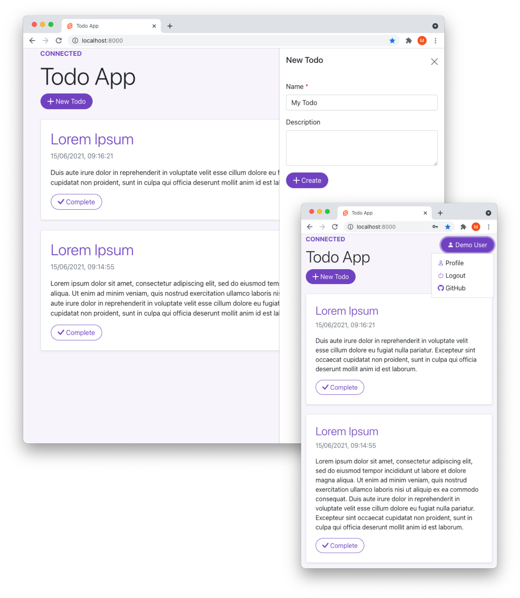

# Todo App



## Application Architecture


## Secrets Management

This repository uses [SOPS](https://github.com/mozilla/sops) with [age](https://github.com/mozilla/sops#encrypting-using-age) for managing secrets.

See [secrets](secrets/) for details.

## Identity and Access Management

- [Keycloak](https://www.keycloak.org/)
  - URL: http://localhost:8081
  - username: `admin`
  - password: `S3c_r3t!`

## Monitoring Stack

- [Grafana](https://grafana.com/oss/grafana/)
  - URL: http://localhost:3000
  - username: `admin`
  - password: `S3c_r3t!`
- [Loki](https://grafana.com/oss/loki/)
- [Promtail](https://grafana.com/docs/loki/latest/clients/promtail/)
- [MinIO](https://min.io/)
  - URL: http://localhost:9000
  - username: `minio`
  - password: `S3c_r3t!`

## Running the App

Before running the below command, make sure you have the unencrypted secrets in the `/env` directory. See [secrets](secrets/) for details.

```bash
> docker compose up --build
```

App: http://localhost:8000

- username: `demouser`
- password: `S3c_r3t!`

## Tools

### JSON Schema Generator

The app uses [JSON Schema](https://json-schema.org/) for message validation. See [json-schema-generator](tools/json-schema-generator) for details.
