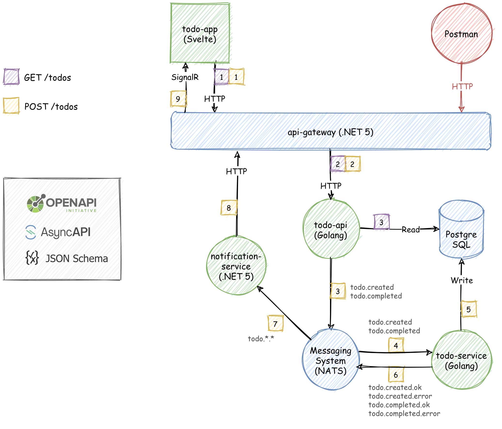

# Todo App



## Running the app

```bash
# Tested with Docker Desktop (Mac and Windows)

# Build and run the app
> docker compose up --build

# Open the app in browser
> open http://localhost:8000
```
