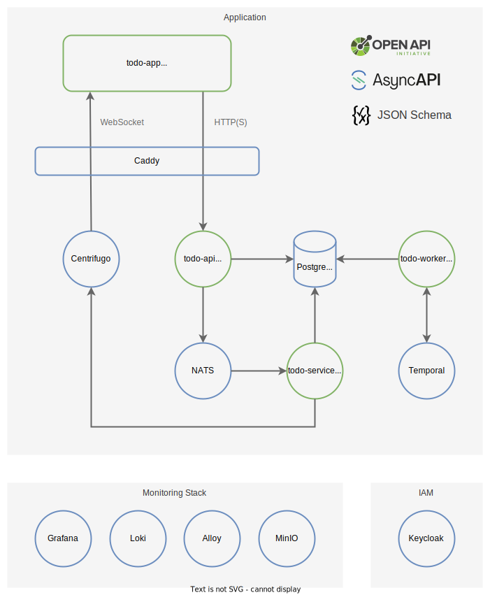

# Todo App

Todo App is a **hobby project** that is primarily focused around being a playground for experimenting with different technologies.

## Application Architecture



## Secrets Management

This repository uses [SOPS](https://github.com/mozilla/sops) with [age](https://github.com/mozilla/sops#22encrypting-using-age) for managing secrets.

See [Configuration and Secrets Management](config/) for details.

## Reverse Proxy

- [Caddy](https://caddyserver.com/)

## Real-Time Messaging

- [Centrifugo](https://centrifugal.dev/)
  - URL: http://centrifugo.todo-app.com
  - password: `S3c_r3t!`

## Workflow Engine

- [Temporal](https://temporal.io/)
  - URL: http://temporal.todo-app.com

## Monitoring Stack

- [Grafana](https://grafana.com/oss/grafana/)
  - URL: http://grafana.todo-app.com
  - username: `admin`
  - password: `S3c_r3t!`
- [Loki](https://grafana.com/oss/loki/)
- [Promtail](https://grafana.com/docs/loki/latest/clients/promtail/)
- [MinIO](https://min.io/)
  - URL: http://minio.todo-app.com
  - username: `console`
  - password: `S3c_r3t!`

## Identity and Access Management

- [Keycloak](https://www.keycloak.org/)
  - URL: http://auth.todo-app.com
  - username: `admin`
  - password: `S3c_r3t!`

## Running the App Locally

1. Add the following entries to your `/etc/hosts` file:

```
127.0.0.1    todo-app.com
127.0.0.1    auth.todo-app.com
127.0.0.1    centrifugo.todo-app.com
127.0.0.1    temporal.todo-app.com
127.0.0.1    grafana.todo-app.com
127.0.0.1    minio.todo-app.com
```

2. Make sure you have the unencrypted secrets in the `env` directory. See [Configuration and Secrets Management](config/) for details.

3. Run Docker Compose

```bash
> docker compose up --build -d
```

4. Open the App in browser: http://todo-app.com
   - Normal user:
     - username: `demouser`
     - password: `S3c_r3t!`
   - Viewer (read-only) user:
     - username: `demoviewer`
     - password: `S3c_r3t!`

## Tools

### JSON Schema Generator

The app uses [JSON Schema](https://json-schema.org/) for message validation. See [json-schema-generator](tools/json-schema-generator) for details.
